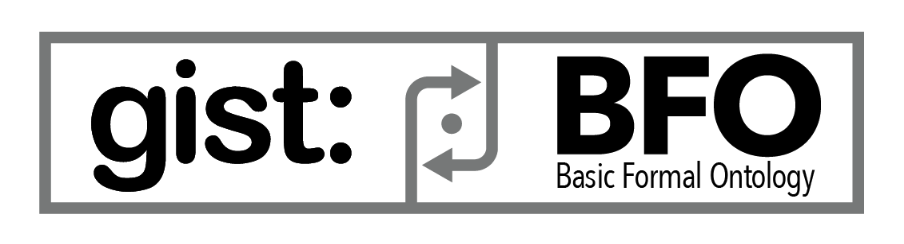
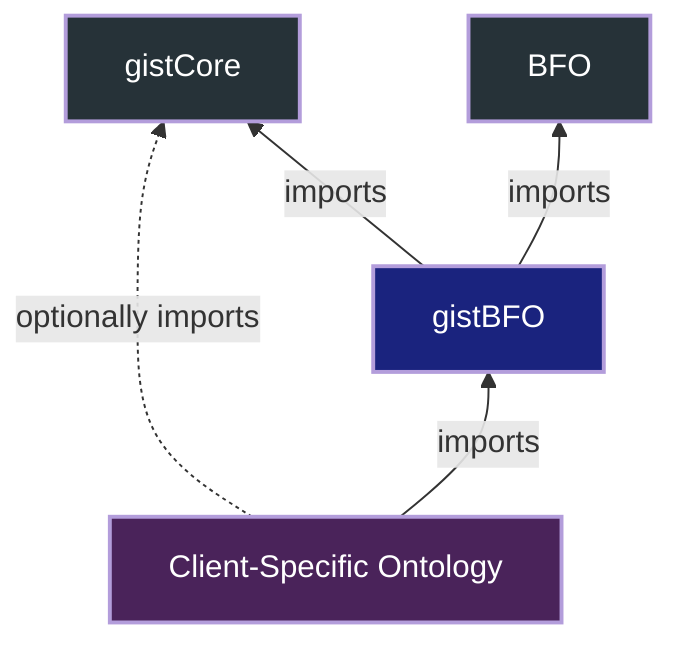

gistBFO
===

 

gistBFO is a version of [gist](https://github.com/semanticarts/gist) that is compatible with the [Basic Formal Ontology (BFO)](https://github.com/BFO-ontology/BFO-2020).

With gistBFO, you can get all the benefits of ontology development with gist while maintaining BFO-compliance.

Content
---

gistBFO contains:

- ~40 `rdfs:subClassOf` assertions between high-level classes of gist and their most specific superclasses in BFO
- A core set of `rdfs:subPropertyOf` assertions between properties in gist and BFO

Annotations are included to provide reasoning behind the assertions.

 

Import Structure
---

gistBFO imports gist and BFO. gistBFO itself can then be imported into a client-specific ontology.

 

Methodology
---

In creating gistBFO, we have attempted to balance a number of things:

1. **Genuine Compliance with BFO:** This would not be an interesting or useful mapping if all gist classes were mapped to BFO's top-level class 'entity'. For this reason, we have tried to map top-level gist classes with their most specific possible superclass in BFO.
2. **Logical Consistency:** The mapping does not generate any logical inconsistencies or contain unsatisfiable classes.
3. **Respecting the Spirit of gist and BFO:** Even if the mappings are logically consistent, they should meet a higher bar of respecting the spirit of the concepts in gist and BFO. This requires an understanding of the intent behind the definitions, much of which is contained in the ontologies' annotations.
4. **Anticipation of Alignment with CCO:** In some cases, if a gist class has a counterpart in the Common Core Ontologies (CCO) and that counterpart is aligned to a certain BFO class, then we considered placing the gist class under that BFO class as well. (See, e.g., `gist:Organization`.)

For more background, read our [whitepaper](https://www.semanticarts.com/wp-content/uploads/2025/01/20241024-BFO-and-gist-Article.pdf).

 

Contributing
---

As of February 2025, gistBFO is in active development. We hope to refine the mappings over time in accordance with the methodological considerations above. We invite feedback and suggestions in the form of GitHub issues.

 

Setting Up the Local Repository
---

- Clone this repository
- Run the script `./tools/setup.cmd`. This script will work on Windows, Linux, and Mac. It copies the `./tools/pre-commit` hook into `.git/hooks`, which means it will run before every commit you make to the repository.

The pre-commit hook does several things when you run `git commit`:

- Prevents commits to the branches `develop` and `main`.
- Runs the serializer. This converts files into a standard Turtle format in order to remove noise in the diffs. As the comments in the file indicate, you should use the pre-approved version of `rdf-toolkit.jar` in this directory, rather than another version that you may have elsewhere on your local drive.
- Note: Any PR containing unserialized commits will be returned for correction.
